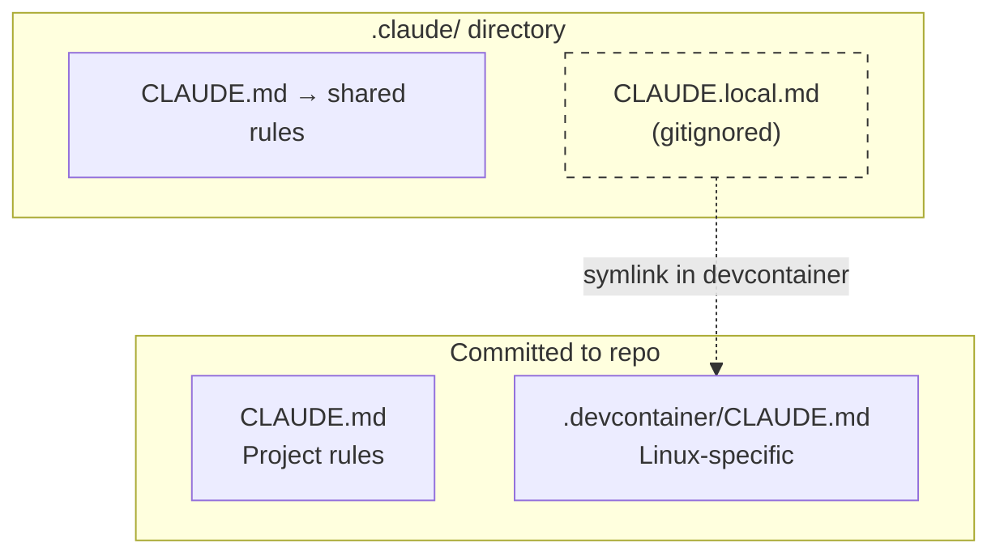
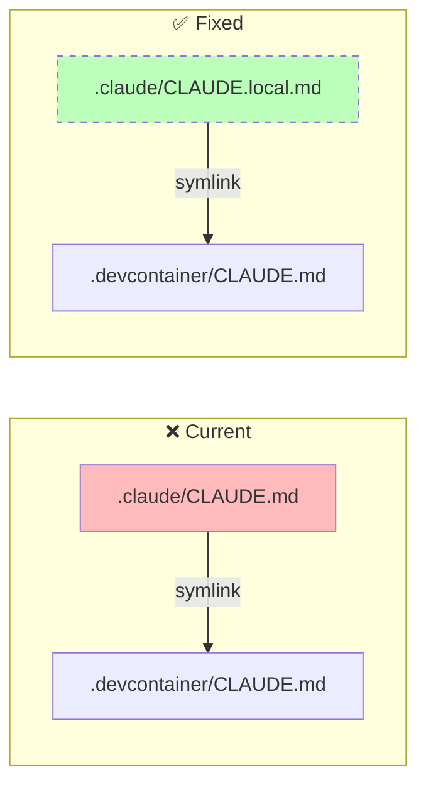

# Claude Code Configuration Structure

This document explains how Claude Code instructions are organized across different environments.

## The Problem

We need different platform commands for host (macOS) vs devcontainer (Linux):

| Action     | macOS      | Linux      |
| ---------- | ---------- | ---------- |
| Open URL   | `open`     | `xdg-open` |
| Timeout    | `gtimeout` | `timeout`  |
| Clipboard  | `pbcopy`   | `xclip`    |

## Solution: Shared + Local Files

Current vs Fixed

How It Works

- .claude/CLAUDE.md — Shared rules for all environments (committed)
- .claude/CLAUDE.local.md — Environment-specific overrides (gitignored)
  - Devcontainer: symlink → .devcontainer/CLAUDE.md
  - Host: could point to a macOS-specific file